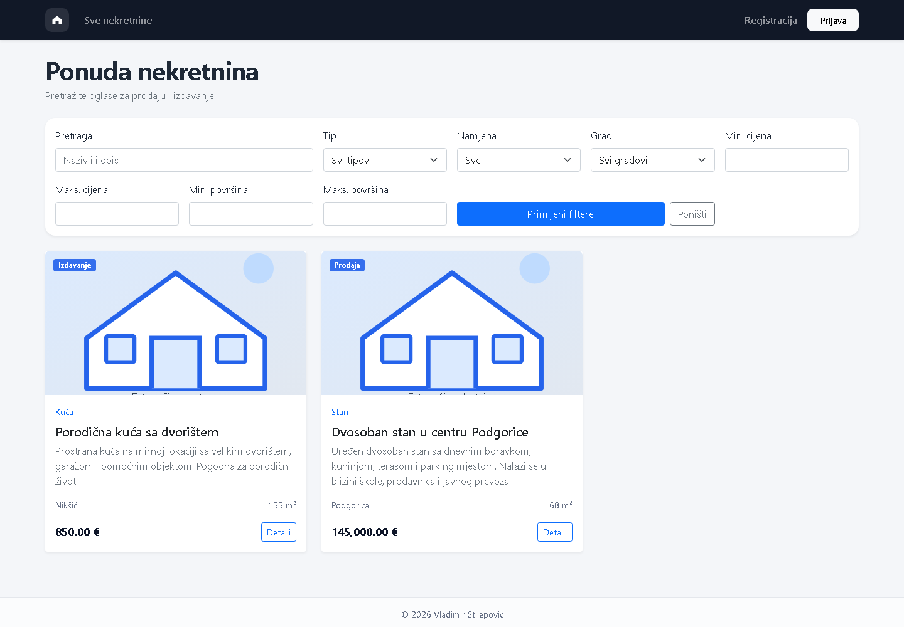
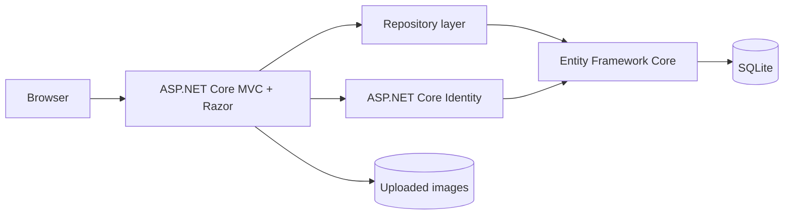

# NekretnineApp

An end-to-end property marketplace built with ASP.NET Core MVC. Advertisers can
publish and manage listings, customers can request viewing appointments, and
administrators can manage users, categories and reporting from one application.

The interface is written in Montenegrin/Serbian (Latin script). The code and
project documentation are in English where practical.



## Highlights

- Role-based flows for administrators, advertisers and customers
- Property search by text, category, purpose, city, price and area
- Multi-image listings with server-side type, size and count validation
- Viewing requests with conflict detection and approval workflow
- ASP.NET Core Identity authentication, lockout and role management
- Admin dashboard with property, user and reservation reports
- SQLite persistence with Entity Framework Core migrations
- Automated repository and domain tests
- Reproducible Docker and GitHub Actions builds

## Architecture



The web layer contains controllers, Razor views and Identity pages. Repository
interfaces isolate persistence queries from the controllers, while EF Core owns
the relational model and migrations. Runtime data, uploaded images and
data-protection keys are excluded from Git.

## Technology

- .NET 8 and ASP.NET Core MVC
- Razor, Bootstrap and vanilla JavaScript
- ASP.NET Core Identity
- Entity Framework Core 8 with SQLite
- MSTest and an in-memory SQLite test database
- Docker and GitHub Actions

## Run locally

Requirements: [.NET 8 SDK](https://dotnet.microsoft.com/download/dotnet/8.0)

```powershell
dotnet restore NekretnineApp.sln
dotnet tool restore
dotnet run --project NekretnineApp/NekretnineApp.csproj
```

Open the HTTPS or HTTP address printed by the application. On first start, EF
Core creates `NekretnineApp/nekretnine.db`, applies the migration and adds the
roles and property categories required by the application.

### Optional demo data

Demo accounts and sample listings are disabled by default. To enable them in
the Development environment, choose a local-only password and store it with
.NET User Secrets:

```powershell
dotnet user-secrets set --project NekretnineApp "DemoSeed:Enabled" "true"
dotnet user-secrets set --project NekretnineApp "DemoSeed:Password" "Choose-A-Local-Password1!"
dotnet run --project NekretnineApp/NekretnineApp.csproj
```

The common password is the value you selected. The seeded accounts are:

| Role | Email |
| --- | --- |
| Administrator | `admin@example.com` |
| Advertiser | `advertiser@example.com` |
| Customer | `user@example.com` |

Demo seeding runs only in Development and rejects weak or missing passwords.

## Run with Docker

```powershell
Copy-Item .env.example .env
docker compose up --build
```

The application is available at <http://localhost:8080>. Docker stores the
database, protection keys and uploaded images in named volumes. Demo data stays
disabled unless `ASPNETCORE_ENVIRONMENT=Development`, `DEMO_SEED_ENABLED=true`
and a strong `DEMO_SEED_PASSWORD` are explicitly set in the local `.env` file.

## Test

```powershell
dotnet test NekretnineApp.sln --configuration Release
```

The test suite covers filtering, active-listing visibility, distinct city
queries, reservation conflicts, form validation, localized status labels and
public-role boundaries.

## Security notes

- No production credentials or database exports are stored in the repository.
- Demo credentials are opt-in, local-only and supplied outside source control.
- Mutating actions use authorization policies and antiforgery validation.
- Uploaded files are renamed by the server and constrained by type, extension,
  size and count.
- Account lockout is enabled for failed login attempts.

## License

[MIT](LICENSE)
